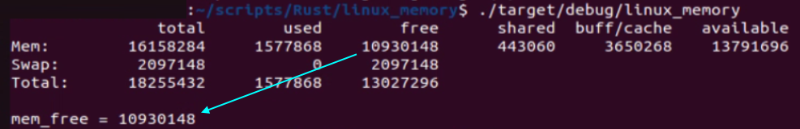

#### Rust: how to read the amount of free available memory from the Linux OS?

_main_free_memory_linux.rs:_
* a small demo program which is using the _free_ command in Linux: https://www.man7.org/linux/man-pages/man1/free.1.html
* the printed result is the number of kilobytes:

